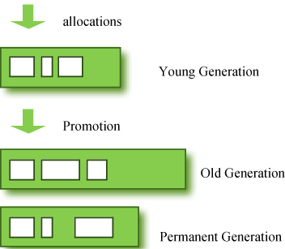

### 垃圾回收机制

Java内存分配和回收的机制概括的说：分代分配，分代回收。对象将根据存活的时间被分为：年轻代（Young Generation）、年老代（Old Generation）、永久代（Permanent Generation，也就是方法区）。

年轻代（Young Generation）：对象被创建时，内存的分配首先发生在年轻代（大对象可以直接被创建在年老代[长字符串或大数组]），大部分的对象在创建后很快就不再使用，因此很快变得不可达，于是被年轻代的GC机制清理掉（IBM的研究表明，98%的对象都是很快消亡的），这个GC机制被称为Minor GC或叫Young GC。注意，Minor GC并不代表年轻代内存不足，它事实上只表示在Eden区上的GC。

### 年轻代

年轻代上的内存分配是这样的，年轻代可以分为3个区域：Eden区（伊甸园，亚当和夏娃偷吃禁果生娃娃的地方，用来表示内存首次分配的区域，再贴切不过）和两个存活区（Survivor 0 、Survivor 1）。

*示例*

1. 绝大多数刚创建的对象会被分配在Eden区，其中的大多数对象很快就会消亡。Eden区是连续的内存空间，因此在其上分配内存极快；
2. 最初一次，当Eden区满的时候，执行Minor GC，将消亡的对象清理掉，并将剩余的对象复制到一个存活区Survivor0（此时，Survivor1是空白的，两个Survivor总有一个是空白的）；
3. 下次Eden区满了，再执行一次Minor GC，将消亡的对象清理掉，将存活的对象复制到Survivor1中，然后清空Eden区；
4. 将Survivor0中消亡的对象清理掉，将其中可以晋级的对象晋级到Old区，将存活的对象也复制到Survivor1区，然后清空Survivor0区；
5. 当两个存活区切换了几次（HotSpot虚拟机默认15次，用-XX:MaxTenuringThreshold控制，大于该值进入老年代，但这只是个最大值，并不代表一定是这个值）之后，仍然存活的对象（其实只有一小部分，比如，我们自己定义的对象），将被复制到老年代。

Eden区是连续的空间，且Survivor总有一个为空。经过一次GC和复制，一个Survivor中保存着当前还活着的对象，而Eden区和另一个Survivor区的内容都不再需要了，可以直接清空，到下一次GC时，两个Survivor的角色再互换。因此，这种方式分配内存和清理内存的效率都极高，这种垃圾回收的方式就是著名的“停止-复制（Stop-and-copy）”清理法（将Eden区和一个Survivor中仍然存活的对象拷贝到另一个Survivor中）

在Eden区，HotSpot虚拟机使用了两种技术来加快内存分配。分别是bump-the-pointer和TLAB（Thread-Local Allocation Buffers），这两种技术的做法分别是：由于Eden区是连续的，因此bump-the-pointer技术的核心就是跟踪最后创建的一个对象，在对象创建时，只需要检查最后一个对象后面是否有足够的内存即可，从而大大加快内存分配速度；而对于TLAB技术是对于多线程而言的，将Eden区分为若干段，每个线程使用独立的一段，避免相互影响。TLAB结合bump-the-pointer技术，将保证每个线程都使用Eden区的一段，并快速的分配内存。

### 老年代

年老代（Old Generation）：对象如果在年轻代存活了足够长的时间而没有被清理掉（即在几次Young GC后存活了下来），则会被复制到年老代，年老代的空间一般比年轻代大，能存放更多的对象，在年老代上发生的GC次数也比年轻代少。当年老代内存不足时，将执行Major GC，也叫 Full GC。

可以使用-XX:+UseAdaptiveSizePolicy开关来控制是否采用动态控制策略，如果动态控制，则动态调整Java堆中各个区域的大小以及进入老年代的年龄。

如果对象比较大（比如长字符串或大数组），Young空间不足，则大对象会直接分配到老年代上（应避免使用短命的大对象）。用-XX:PretenureSizeThreshold来控制直接升入老年代的对象大小，大于这个值的对象会直接分配在老年代上。

Full GC触发条件：
（1）调用System.gc时，系统建议执行Full GC，但是不必然执行
（2）老年代空间不足
（3）方法去空间不足
（4）通过Minor GC后进入老年代的平均大小大于老年代的可用内存
（5）由Eden区、From Space区向To Space区复制时，对象大小大于To Space可用内存，则把该对象转存到老年代，且老年代的可用内存小于该对象大小。

### 永久代
方法区存放了要加载的类的信息(如类名，修饰符)、类中的静态变量、final定义的常量、类中的field、方法信息，当开发人员调用类对象中的getName、isInterface等方法来获取信息时，这些数据都来源于方法区。方法区是全局共享的，在一定条件下它也会被GC。当方法区使用的内存超过它允许的大小时，就会抛出OutOfMemory：PermGen Space异常。
在Hotspot虚拟机中，这块区域对应的是Permanent Generation(持久代)，一般的，方法区上执行的垃圾收集是很少的，因此方法区又被称为持久代的原因之一，但这也不代表着在方法区上完全没有垃圾收集，其上的垃圾收集主要是针对常量池的内存回收和对已加载类的卸载。在方法区上进行垃圾收集，条件苛刻而且相当困难。

运行时常量池（Runtime Constant Pool）是方法区的一部分，用于存储编译期就生成的字面常量、符号引用、翻译出来的直接引用（符号引用就是编码是用字符串表示某个变量、接口的位置，直接引用就是根据符号引用翻译出来的地址，将在类链接阶段完成翻译）；运行时常量池除了存储编译期常量外，也可以存储在运行时间产生的常量，比如String类的intern()方法，作用是String维护了一个常量池，如果调用的字符“abc”已经在常量池中，则返回池中的字符串地址，否则，新建一个常量加入池中，并返回地址。

永久代的回收有两种：常量池中的常量，无用的类信息，常量的回收很简单，没有引用了就可以被回收。对于无用的类进行回收，必须保证3点：
1. 类的所有实例都已经被回收。2. 加载类的ClassLoader已经被回收。3. 类对象的Class对象没有被引用（即没有通过反射引用该类的地方）。
永久代的回收并不是必须的，可以通过参数来设置是否对类进行回收。
