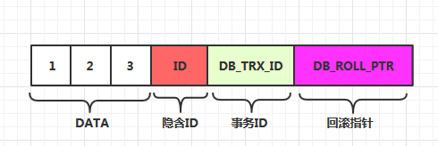
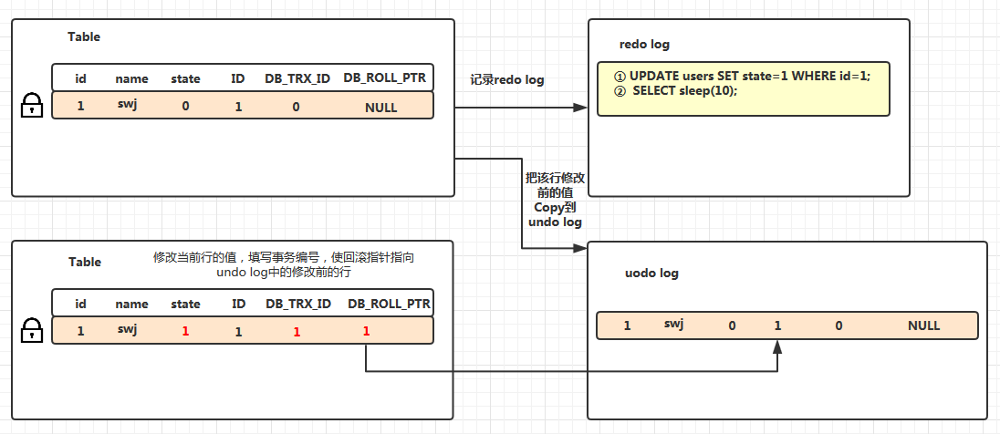

> MySQL InnoDB存储引擎，实现的是基于多版本的并发控制协议——MVCC
>
> 优点：读不加锁，读写不冲突。在读多写少的OLTP应用中，读写不冲突是非常重要的，极大的增加了系统的并发性能，这也是为什么现阶段，几乎所有的RDBMS，都支持了MVCC。
>
> 使得大部分支持行锁的事务引擎，不再单纯的使用行锁来进行数据库的并发控制，取而代之的是把数据库的行锁与行的多个版本结合起来，只需要很小的开销,就可以实现非锁定读，从而大大提高数据库系统的并发性能
>
> 缺点：系统开销 比最大（较表锁、行级锁）

> MVCC有下面几个特点：
> 每行数据都存在一个版本，每次数据更新时都更新该版本
> 
> 修改时Copy出当前版本随意修改，各个事务之间无干扰
> 
> 保存时比较版本号，如果成功（commit），则覆盖原记录；失败则放弃copy（rollback）
> 
> Innodb的实现方式是：
> 
> 事务以排他锁的形式修改原始数据
> 
> 把修改前的数据存放于undo log，通过回滚指针与主数据关联
> 
> 修改成功（commit）啥都不做，失败则恢复undo log中的数据（rollback）
> 
> Innodb的实现真算不上MVCC，因为并没有实现核心的多版本共存，undo log中的内容只是串行化的结果，记录了多个事务的过程，不属于多版本共存。
> 
> Innodb只是借了MVCC这个名字，提供了读的非阻塞而已

---

### MVCC的工作机制

* **SELECT**

   1. 只会查找行的版本号小于或是等于事务的系统版本号,确保数据读取的行，要么是在事务开始前已经存在的，要么是事务自身插入或修改过的。
   2. 行的删除版本号要么未定义，要么大于当前事务版本号。这可以确保事务读取到的行，在事务开始之前未被删除。

* **INSERT**

   为新插入的每一行保存当前系统版本号作为行版本号

* **DELETE**

   为删除的每一行保存当前系统版本号作为行删除标识

* **UPDATE**

   为新插入的每一行保存当前系统版本号作为行版本号，同时保存当前系统版本号到原来的行作为行删除标识
   
   ---

*InnoDB实现MVCC的方法是*：`InnoDB存储引擎在每行记录上存有三个字段`



1. DB_TRX_ID（事务ID）：6byte，最后一个事务的更新和插入
2. DB_ROLL_PTR（回滚指针）：7byte，指向当前记录项的undo log信息
   `指向写到rollback segment（回滚段）的一条undo log记录（update操作的话，记录update前的ROW值）`
3. DB_ROW_ID: 大小是6byte，插入的新的数据行的id
   `没有主键时,因为MYSQL默认聚簇表,会自动生成一个ROWID`
4. deleted_bit，删除标记位，删除时设置


### read_view：行记录的可见性

MVCC实现了多个并发事务更新同一行记录会时产生多个记录版本。新开始的事务如果要查询这行记录，应该获取到哪个版本呢？***即哪个版本对这个事务是可见的。这个问题就是行记录的可见性问题。***


两个变量分别low_limit_id和up_limit_id，根据注释可知，前者表示事务id大于此值的行记录都不可见，后者表示事务id小于此值的行记录都可见。

生成read_view：每个事务在开始的时候都会根据当前系统的活跃事务链表创建一个read_view。

```
mysql> show engine innodb status \G
*************************** 1. row ***************************
  Type: InnoDB
  Name:
Status:
=====================================
2015-09-13 23:26:42 12cf39000 INNODB MONITOR OUTPUT
=====================================
------------
TRANSACTIONS
------------
Trx id counter 13099
Purge done for trx's n:o < 13097 undo n:o < 0 state: running but idle
History list length 380
```

新建事务(当前事务)与正在内存中commit 的事务不在活跃事务链表中.
ct-trx --> trx11 --> trx9 --> trx6 --> trx5 --> trx3;
ct-trx 表示当前事务的id

```
read_view->creator_trx_id = ct-trx;

read_view->up_limit_id = trx3;

read_view->low_limit_id = trx11;

read_view->trx_ids = [trx11, trx9, trx6, trx5, trx3];

read_view->m_trx_ids = 5;
```

```
read_view中保存了当前全局的事务的范围：
【low_limit_id， up_limit_id】

1. 当行记录的事务ID小于当前系统的最小活动id，就是可见的。
    　　if (trx_id < view->up_limit_id) {
    　　　　return(TRUE);
    　　}
2. 当行记录的事务ID大于当前系统的最大活动id（也就是尚未分配的下一个事务的id），就是不可见的。
    　　if (trx_id >= view->low_limit_id) {
    　　　　return(FALSE);
    　　}
3. 当行记录的事务ID在活动范围之中时，判断是否在活动链表中，如果在就不可见，如果不在就是可见的。
    　　for (i = 0; i < n_ids; i++) {
    　　　　trx_id_t view_trx_id
    　　　　　　= read_view_get_nth_trx_id(view, n_ids - i - 1);
    　　　　if (trx_id <= view_trx_id) {
    　　　　return(trx_id != view_trx_id);
    　　　　}
    　　}
```


**MVCC结合隔离级别:**

```
1.READ UNCOMMITTED ，不适用MVCC读，可以读到其他事务修改甚至未提交的
2.READ COMMITTED ，其他事务对数据库的修改,只要已经提交,其修改的结果就是可见的,
 与这两个事务开始的先后顺序无关，不完全适用于MVCC读，
3.REPEATABLE READ，可重复读，完全适用MVCC，只能读取在它开始之前已经提交的事务对数据库的修改,
  在它开始以后,所有其他事务对数据库的修改对它来说均不可见
4.SERIALIZABLE ，完全不适合适用MVCC，这样所有的query都会加锁，再它之后的事务都要等待 
```

MVCC只工作在REPEATABLE READ和READ COMMITED隔离级别下


### 快照读 (snapshot read)

> 读取的是记录的可见版本 (有可能是历史版本)，不用加锁



### 当前读 (current read)

> 读取的是记录的最新版本，并且，当前读返回的记录，都会加上锁，保证其他事务不会再并发修改这条记录

