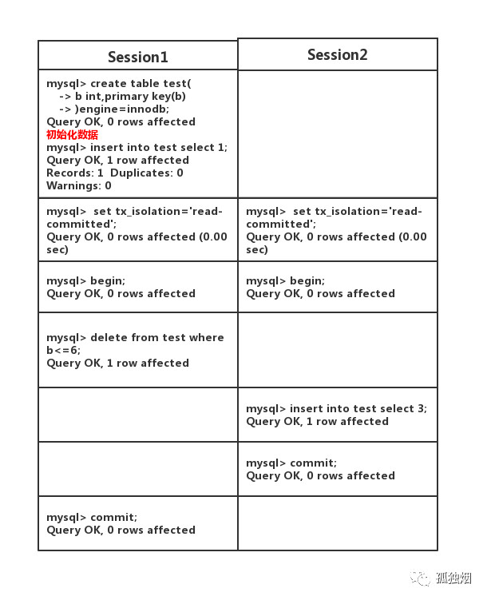
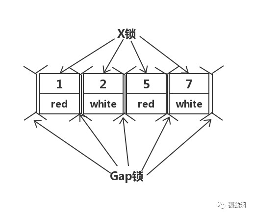

## 事务的基本要素（ACID）

1. 原子性（Atomicity）：一个事务必须被视为一个不可分割的最小工作单元，整个事务中的所有操作要么全部提交成功，要么全部失败回滚，对于一个事务来说，不可以只执行其中的一部分操作。
2. 一致性（Consistency）：数据库总是从一个一致性的状态转到另一个一致性的状态。
> 假设用户A和用户B两者的钱加起来一共是5000，那么不管A和B之间如何转账，转几次账，事务结束后两个用户的钱加起来应该还得是5000，这就是事务一致性。
3. 隔离性（Isolation）：一个事务所做的修改在最终提交之前，对其他事务是不可见的。
4. 持久性（Durability）：一旦事务提交，则其所做的修改就会永久的保存到数据库中。不会因为系统故障等情况而丢失所做的修改。

## 事务的并发问题

1. 脏读：事务A读到了事务B未提交的数据（事务A读取了事务B更新的数据，然后B回滚操作，那么A读取到的数据是脏数据） #update
2. 不可重复读：事务 A 多次读取同一数据，事务 B 在事务A多次读取的过程中，对数据作了更新并提交，导致事务A多次读取同一数据时，结果 不一致 #update
3. 幻读：事务A第一次查询得到一行记录row1，事务B提交修改后，事务A第二次查询得到两行记录row1和row2  #insert/delete
   
   > 系统管理员A将数据库中所有学生的成绩从具体分数改为ABCDE等级，但是系统管理员B就在这个时候插入了一条具体分数的记录，当系统管理员A改结束后发现还有一条记录没有改过   来，就好像发生了幻觉一样，这就叫幻读。

> 不可重复读的和幻读很容易混淆，不可重复读侧重于修改，幻读侧重于新增或删除。解决不可重复读的问题只需锁住满足条件的行，解决幻读需要锁表

## MySQL事务隔离级别
| 事务隔离级别                 | 脏读 | 不可重复读 | 幻读 |
| ---------------------------- | ---- | ---------- | ---- |
| 读未提交（read-uncommitted） | 是   | 是         | 是   |
| 不可重复读（read-committed） | 否   | 是         | 是   |
| 可重复读（repeatable-read）  | 否   | 否         | 是   |
| 串行化（serializable）       | 否   | 否         | 否   |

`mysql默认的事务隔离级别为repeatable-read,项目中一般选用READ-COMMITTED`
`oracle,sql server默认的事务隔离级别为read commited`

`**为什么默认的隔离级别都会选用read commited 原因有二：repeatable存在间隙锁会使死锁的概率增大，在RR隔离级别下，条件列未命中索引会锁表！而在RC隔离级别下，只锁行**`

```
SELECT @@GLOBAL.tx_isolation, @@tx_isolation;
+-----------------------+----------------+
| @@GLOBAL.tx_isolation | @@tx_isolation |
+-----------------------+----------------+
| READ-COMMITTED        | READ-COMMITTED |
+-----------------------+----------------+
1 row in set, 2 warnings (0.00 sec)

1.查看当前会话隔离级别
select @@tx_isolation;

2.查看系统当前隔离级别
select @@global.tx_isolation;

设置事务隔离级别
SET SESSION TRANSACTION ISOLATION LEVEL READ COMMITTED;
SET GLOBAL TRANSACTION ISOLATION LEVEL REPEATABLE READ;
```

### 读提交
> 写数据只会锁住相应的行
>
> **项目中实际选中**

**二级封锁协议**：在修改数据之前对其加X锁，直到事务结束释放X锁。读数据之前必须加S锁，读完即可释放S锁。

**Mysql的InnoDB引擎在[READ COMMITTED]隔离级别下对读操作没有加锁**。解决脏读：MVCC

### 可重复复
> 如果检索条件有索引（包括主键索引）的时候，默认加锁方式是next-key 锁
> 如果检索条件没有索引，更新数据时会锁住整张表
> 一个间隙被事务加了锁，其他事务是不能在这个间隙插入记录的，这样可以防止幻读

### 串行化
> 读写数据都会锁住整张表
>
> 从MVCC并发控制退化为基于锁的并发控制。不区别快照读与当前读，所有的读操作均为当前读，读加读锁 (S锁)，写加写锁 (X锁)。

## MYSQL默认隔离级别探讨

MYSQL主从复制的binlog格式：
1. statement：记录的是修改SQL语句(sleep() now()会出现不同步问题)
2. row：记录的是每行实际数据的变更
3. mixed：statement和row模式的混合

> Mysql在5.0这个版本以前，binlog只支持STATEMENT这种格式！而这种格式在读已提交(Read Commited)这个隔离级别下主从复制是有bug的，因此Mysql将可重复读(Repeatable Read)作为默认的隔离级别

---

**举例说明**

在主(master)上执行如下事务：



```
主(master)上执行
select * from test；

+---+
| b |
+---+
| 3 |
+---+
1 row in set
```

```
在从(slave)上执行
Empty set
```

> 在master上执行的顺序为先删后插！而此时binlog为STATEMENT格式，它记录的顺序为先插后删！从(slave)同步的是binglog，因此从机执行的顺序和主机不一致！就会出现主从不一致！


**解决方案**

1. 隔离级别设为**可重复读(Repeatable Read)**,在该隔离级别下引入间隙锁。当`Session 1`执行delete语句时，会锁住间隙。那么，`Ssession 2`执行插入语句就会阻塞住！
2. 将binglog的格式修改为row格式，此时是基于行的复制，自然就不会出现sql执行顺序不一样的问题！奈何这个格式在mysql5.1版本开始才引入。因此由于历史原因，mysql将默认的隔离级别设为**可重复读(Repeatable Read)**，保证主从复制不出问题！

## MYSQL生产环境隔离级别探讨

可重复读(Repeatable Read)，简称为RR

读已提交(Read Commited)，简称为RC

1. 在RR隔离级别下，存在间隙锁，导致出现死锁的几率比RC大的多！

```
+----+-------+
| id | color |
+----+-------+
|  1 |  red  |
|  2 | white |
|  5 |  red  |
|  7 | white |
+----+-------+

PRIMARY KEY (`id`)
```

`select * from test where id <3 for update;`

> RR隔离级别下，存在间隙锁，可以锁住(2,5)这个间隙，防止其他事务插入数据！
>
> 在RC隔离级别下，不存在间隙锁，其他事务是可以插入数据！ **在RC隔离级别下并不是不会出现死锁，只是出现几率比RR低而已**

2. 在RR隔离级别下，条件列未命中索引会锁表！而在RC隔离级别下，只锁行

`update test set color = 'blue' where color = 'red'; `

RC隔离级别下，其先走聚簇索引，进行全部扫描。MySQL做了优化，在MySQL Server过滤条件，发现不满足后，会调用unlock_row方法，把不满足条件的记录放锁

RR隔离级别下，走聚簇索引，进行全部扫描，最后会将整个表锁上:



3. 在RC隔离级别下，半一致性读(semi-consistent)特性增加了update操作的并发性！

> 在5.1.15的时候，innodb引入了一个概念叫做“semi-consistent”，减少了更新同一行记录时的冲突，减少锁等待。
> 半一致性读就是：一个update语句，如果读到一行已经加锁的记录，此时InnoDB返回记录最近提交的版本，由MySQL上层判断此版本是否满足update的where条件。若满足(需要更新)，则MySQL会重新发起一次读操作，此时会读取行的最新版本(并加锁)！

Session1执行

```
update test set color = 'blue' where color = 'red'; 
```

先不Commit事务！
与此同时Ssession2执行

```
update test set color = 'blue' where color = 'white'; 
```

session 2尝试加锁的时候，发现行上已经存在锁，InnoDB会开启semi-consistent read，返回最新的committed版本(1,red),(2，white),(5,red),(7,white)。MySQL会重新发起一次读操作，此时会读取行的最新版本(并加锁)!
而在RR隔离级别下，Session2只能等待！