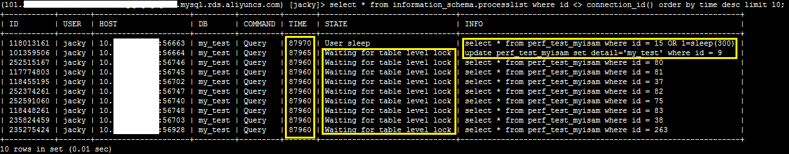

#### sleep

> sleep（duration）,其中duration的单位是秒

**示例：**

* `select sleep(2);`

   ```
   mysql> select sleep(2);
   +----------+
   | sleep(2) |
   +----------+
   |        0 |
   +----------+
   1 row in set (2.00 sec)
   ```

* `select * from test where 0 = sleep(2)  limit 2;  `

```
mysql> select * from test where 0 = sleep(2)  limit 2;  
+----+-----------+------+---------------------+---------------------+--------+
| id | task_name | ip2  | begin_time          | end_time            | result |
+----+-----------+------+---------------------+---------------------+--------+
|  2 | 1         |    1 | 1899-12-30 01:00:00 | 1899-12-30 01:00:00 |      0 |
|  3 | myTest-ww | 3333 | 2015-10-10 10:10:10 | 2015-10-11 11:11:11 |      0 |
+----+-----------+------+---------------------+---------------------+--------+
2 rows in set (4.00 sec)
```

#### connection_id

> 对于已经建立的连接的客户端，都有一个唯一的连接ID。CONNECTION_ID()返回的是这个连接的连接ID或者thread ID。
>
> CONNECTION_ID=thread ID=INFORMATION_SCHEMA.PROCESSLIST.ID=SHOW PROCESSLIST里的ID=Performance Schema threads.PROCESSLIST_ID

```
mysql> select connection_id();
+-----------------+
| connection_id() |
+-----------------+
|           17404 |
+-----------------+
1 row in set (0.00 sec)
```

#### show full processlist;

> `select * from information_schema.PROCESSLIST order by id asc;`



#### KILL [CONNECTION | QUERY] thread_id;

> mysql运行某些语句时，会因数据量太大而导致死锁，没有反映。这个时候，就需要kill掉某个正在消耗资源的query语句即可
>
> KILL允许自选的CONNECTION或QUERY修改符：
>
> > KILL CONNECTION与不含修改符的KILL一样：它会终止与给定的thread_id有关的连接。
> >
> > KILL QUERY会终止连接当前正在执行的语句，但是会保持连接的原状。